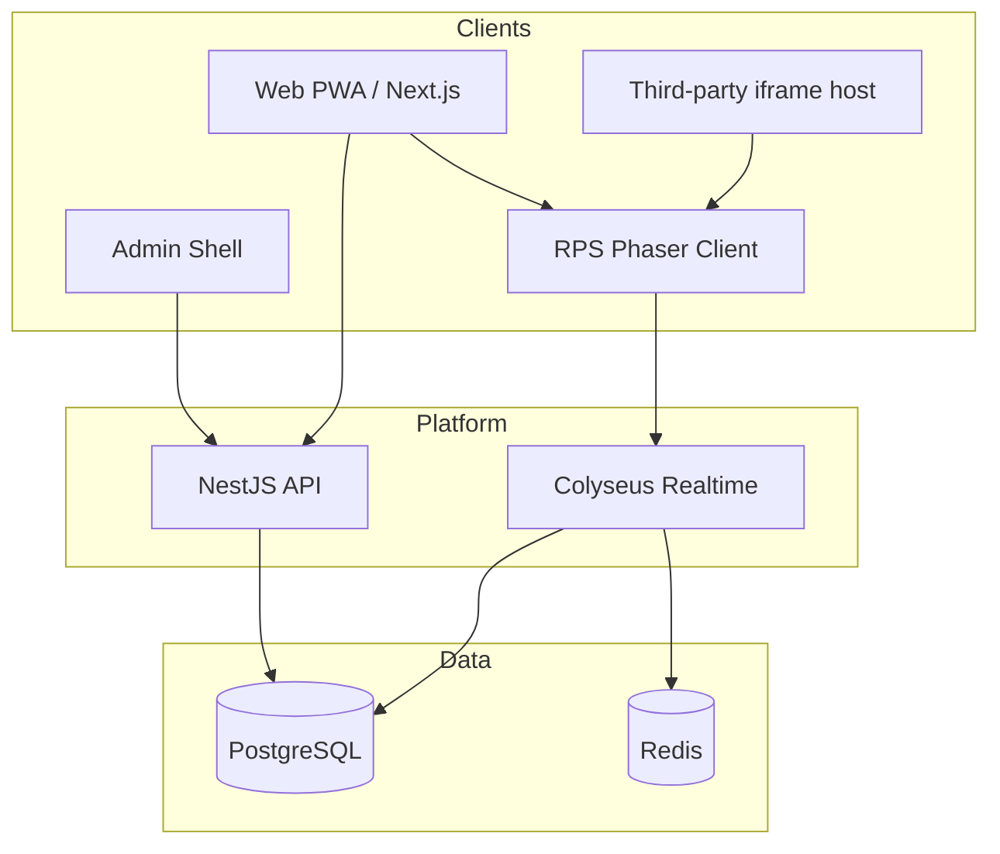

# Architecture

## Overview

Kampi.fun separates **platform shell** (web/admin/API), **authoritative realtime** (Colyseus), and **embeddable game clients** (Phaser). Shared contracts and domain logic live in packages.



## Authority model

| Concern | Owner |
|---------|-------|
| Match state, timers, round resolution | Realtime server |
| Entry fee deduction, payout, refund | Domain services + PostgreSQL transactions |
| Balances exposed to clients | API (read-only) |
| Player intentions (moves) | Game client → realtime |

Clients never compute winners, payouts, or valid move acceptance.

## Match lifecycle

```text
WAITING → ACTIVE → RESOLVING → FINISHED
                           ↘ ABORTED (refund)
```

1. Player joins lobby queue with auth token.
2. Two humans match immediately, or bot fills after `BOT_FILL_AFTER_MS`.
3. Entry fees deducted in a transaction before `ACTIVE`.
4. Server runs rounds; choices concealed until both lock or timeout.
5. Best-of-three winner receives one idempotent payout.
6. Disconnect within `RECONNECT_GRACE_MS` restores state via Colyseus reconnection token.

## Packages

- `@kampi/contracts` — Zod schemas, shared env parsing, legacy RPS helpers
- `@kampi/database` — Prisma client
- `@kampi/domain` — wallet mutations, purchase provider interface
- `@kampi/game-sdk` — modular game SDK (`common` / `client` / `server` / `embed` / `testing`)
- `@kampi/game-rps-core` — RPS manifest + schemas (pure)
- `@kampi/game-penalty` — Penalty Duel rules (pure)
- `@kampi/config` — shared TS/ESLint/Prettier

Game clients: `apps/game-rps` (5173), `apps/game-penalty` (5174). See [game-sdk.md](./game-sdk.md) and [penalty-duel.md](./penalty-duel.md).

## Future real-money phase

A real-money version would be a **separate project phase** requiring payment PCI scope, KYC/AML, licensing, fraud controls, geolocation, enhanced auditing, and regulatory review — not included in this prototype.
